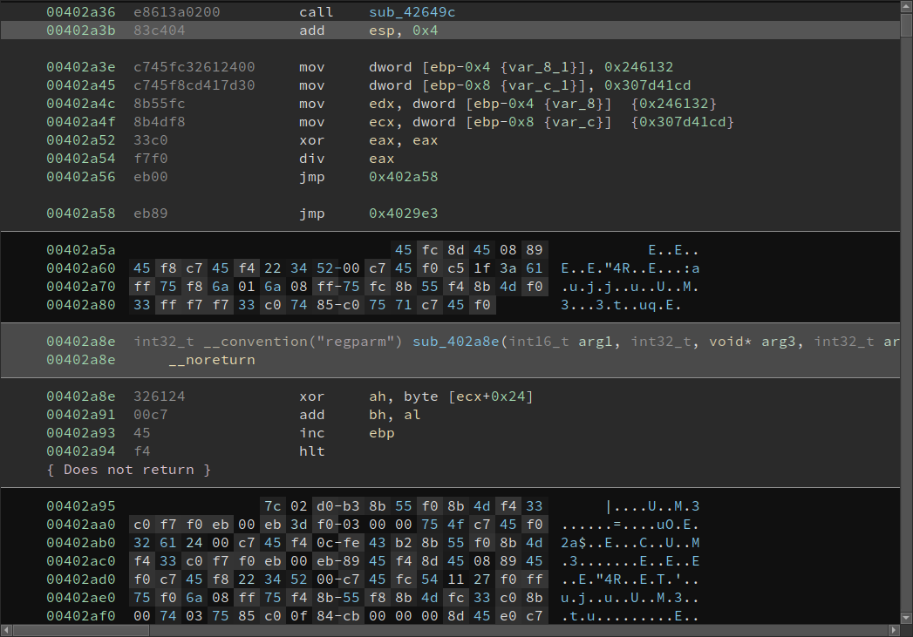
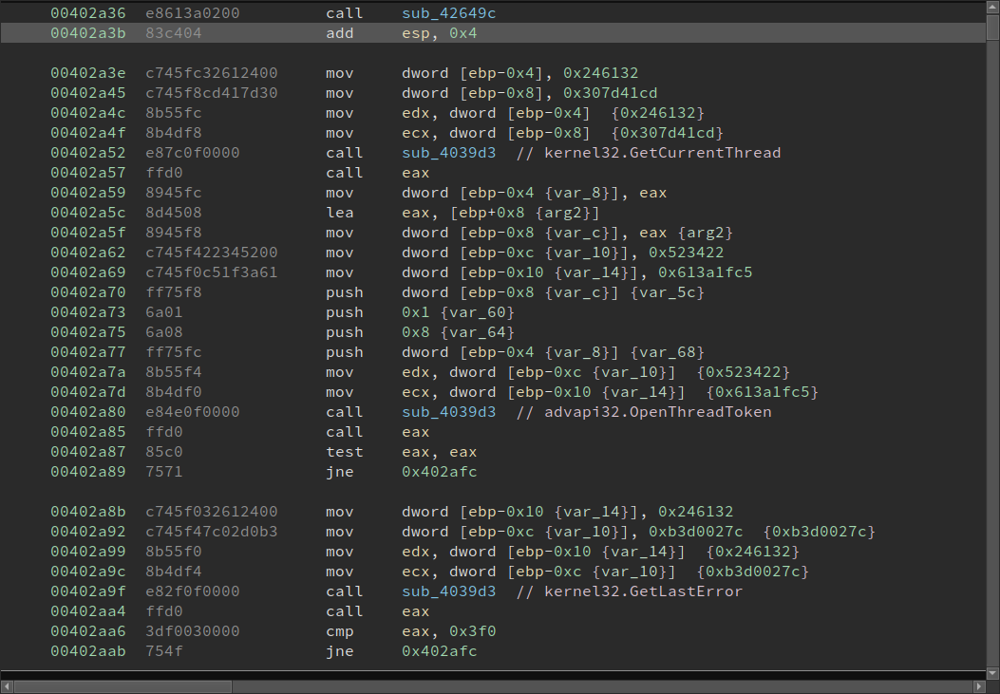

# Script: FlareOn8 - Evil

A plugin to undo the exception based obfuscation of challenge 9, Evil, of the [2021 FlareOn challenge](https://2021.flare-on.com). You can read [the official solution](https://www.mandiant.com/resources/flare-on-8-challenge-solutions) on Mandiant's website.

## Output

The script deobfuscates code like this:

To more readable code like this:

