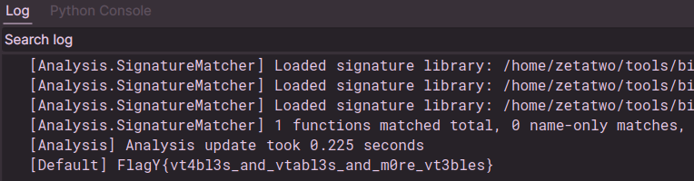

# Script: Flagyard - Tables

A script to solve the traning lab [Tables](https://flagyard.com/labs/training-labs/3/challenges/0477aaea-49cb-4ff8-82ba-2068830e8967) from [Flagyard](https://flagyard.com/).
The script uses HLIL to build the search graph and then finds a path through it to the target function and finally converts that path into the flag.

## Output

The script takes about a second to run on [the binary](example/tables) and eventually gives output like this:

