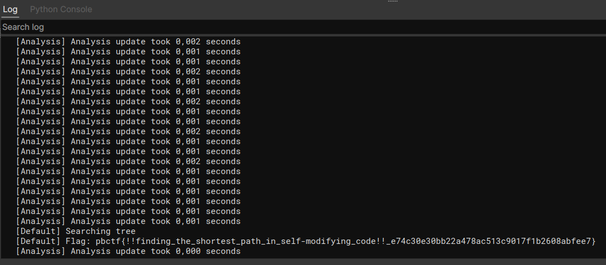

# Script: pbctf 2021 Binary Tree

A script to solve the challenge [Binary Tree](https://ctftime.org/task/17581) from the [2021 pbctf](https://ctftime.org/event/1371).
The script uses MLIL to build up the search graph and then finds the shortest path through it and finally converts that path into the flag.

## Output

The script takes about 30 seconds to run and eventually gives output like this:

