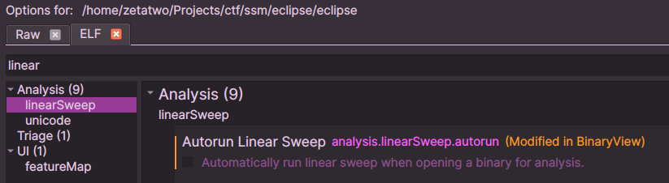
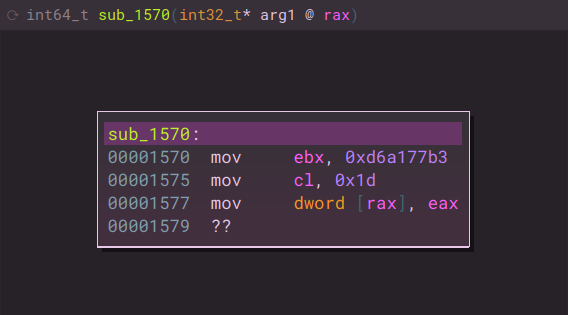
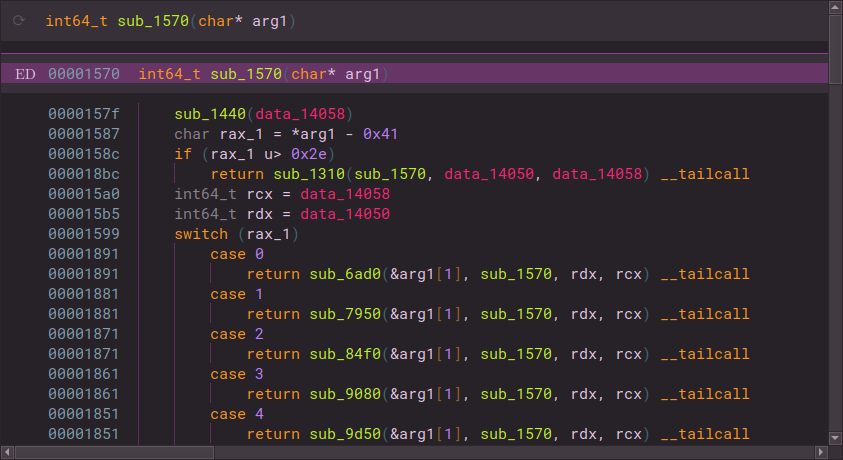
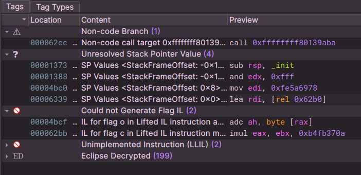
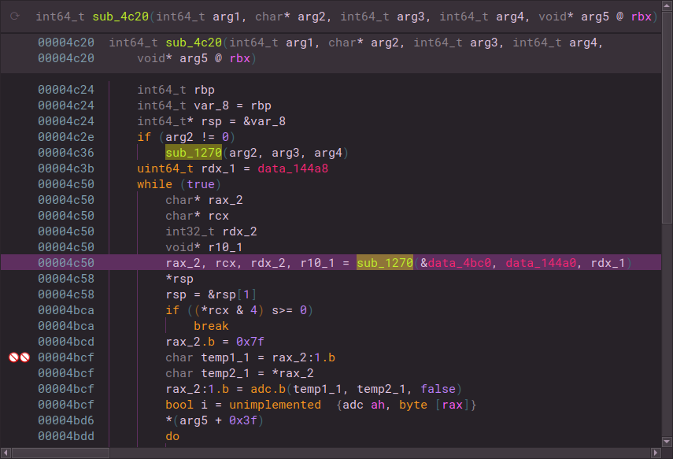
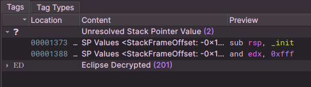

# Script: SSM24 - Eclipse

A script to solve the challenge Eclipse (TODO: add link) from [Säkerhets-SM 2024 Finals](https://sakerhetssm.se). The challenge including source code can be found in the SSM24 archive (TODO: add link).

The script consists of three stages. First it uses HLIL to find parameters to decrypt functions and decrypts them. The second stage builds a graph of all the function calls and how they affect the key state. Finally, the third stage iterates over all paths in the graph and uses the corresponding key state transitions to try to decrypt the flag until a successful path is found.

## Usage

First we load the binary with linear sweep disabled since the encrypted nature of the binary will generate a lot of bogus functions.



We can see that we have an encrypted function which doesn't make any sense:



Then we run the first stage to decrypt many functions. Note that it works iteratively by decrypting everything it finds, letting the analysis update and looking for new candidates until no new are found:

```
>>> import ssm24_eclipse
>>> ssm24_eclipse.stage1_decrypt_eclipse(bv)
0x1900 -> crypt(0x1570, 0x351, 0x7294f9855b69bc48)
0x6a00 -> crypt(0x68f0, 0xd1, 0x6948974c415dd7e0)
0x2330 -> crypt(0x22a0, 0x57, 0x3fbf3f590dfb9c61)
0xc960 -> crypt(0xc870, 0xb1, 0xf6f5d850d1220033)
0xc640 -> crypt(0xc5b0, 0x57, 0x7aaafb4dd58e26d)
0xc720 -> crypt(0xc650, 0x9f, 0x8ee2c7dedc5ded59)
...
```

We now see that the above function and many more look much better:



However, if we take a look at the tags tab we still see some issues:



Looking at one of these functions, we see that Binja incorrectly joined the encrypted data with a function which resulted in it being unable to resolve the constant value in the decryption call. 




By manually going through these locations and defining a separate function at the decryption target, we can separate the functions, resolve the confusion and then run the first stage again:

```
>>> ssm24_eclipse.stage1_decrypt_eclipse(bv)
0x4c50 -> crypt(0x4bc0, 0x57, 0xfa7fb0ada077774c)
0x6340 -> crypt(0x62b0, 0x57, 0x13370a20b03d08c8)
```

The only remaining tags are not irrelevant and we can be moderately sure that we have decrypted the binary. 



We can now run stage two and three to get the flag:

```
>>> call_graph = ssm24_eclipse.stage2_build_graph(bv)
>>> ssm24_eclipse.stage3_find_solution(bv, call_graph)
Path: 0x1120 -> 0x18d0 -> 0x1570 -> 0x7950 -> 0x77d0 -> 0x2a10 -> 0x2820 -> 0x7da0 -> 0x7cb0 -> 0xb860 -> 0xb7a0 -> 0x36f0 -> 0x3650 -> 0x4d60 -> 0x4d00 -> 0x6770 -> 0x6710 -> 0x6810 -> 0x67b0 -> 0x6b50 -> 0x1310
State: 0x7294f9855b69bc48, 0x497c60c34a4756bf, 0x5c970824421a723d, 0x39065fd87d0ea0b8, 0x9386ddbf8ef9175f, 0xee275a42a88e4d53, 0x290eb7988867e878, 0xab8d227f0b1fe723, 0x47b2b1d76030d1b, 0x46f4bf5197d0f752
Decrypted: SSM{return_from_total_darkness}
```
